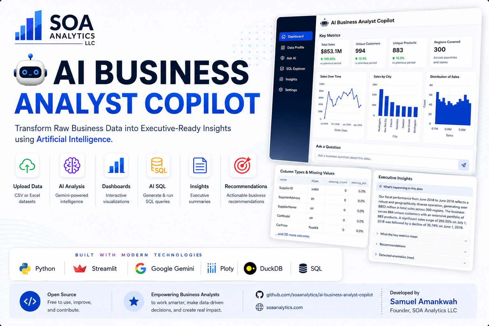
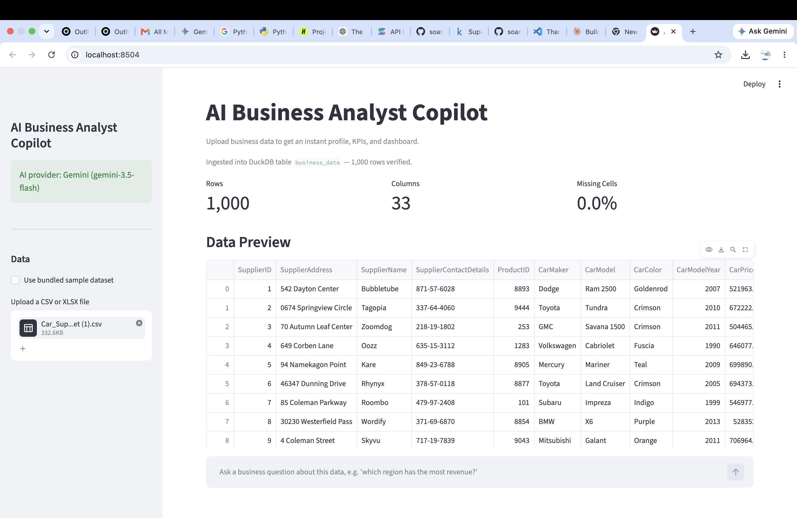
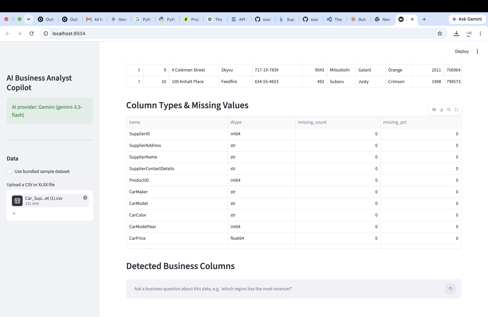
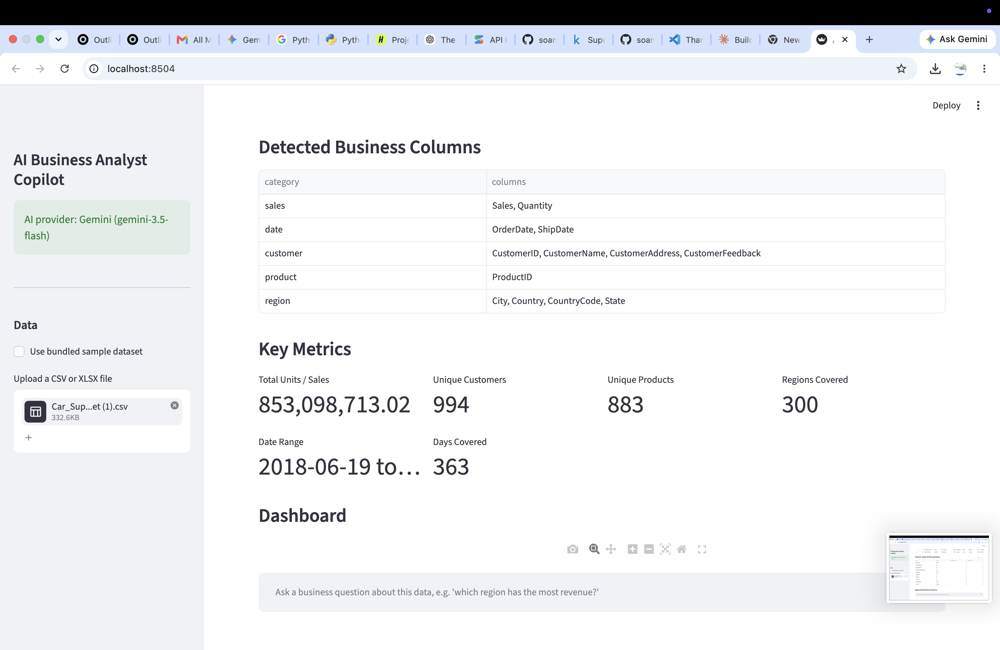
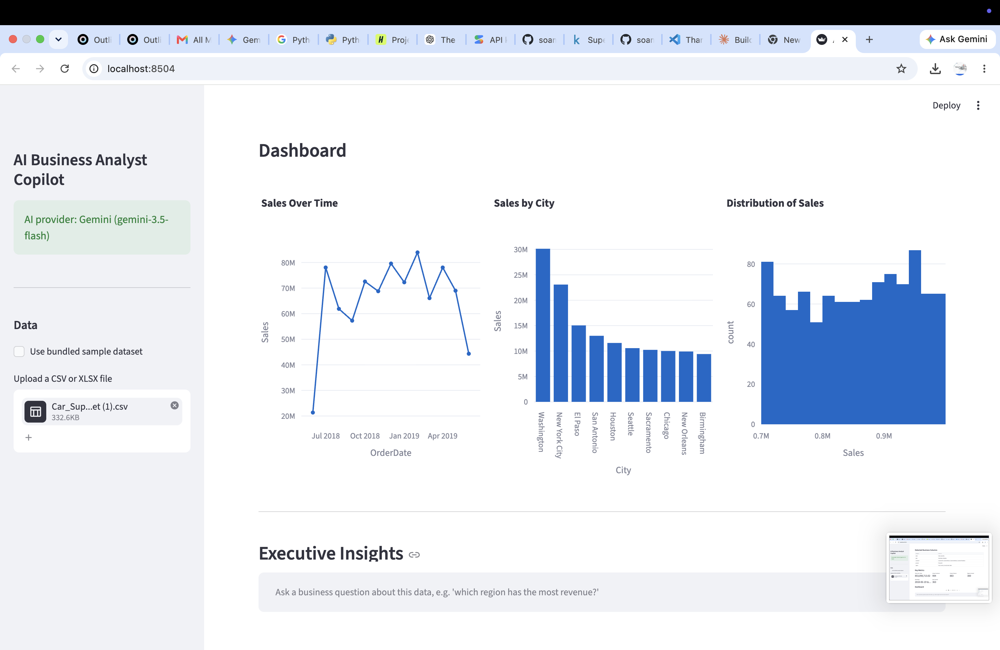
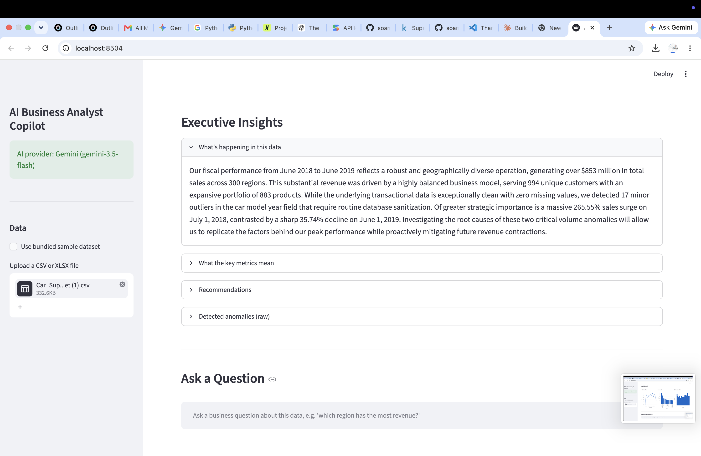

<p align="center">
    
</p>

<h1 align="center">🤖 # 🚀 AI-Powered Business Intelligence Platform</h1>

<p align="center">
Transform Raw Business Data into Executive-Ready Insights using Artificial Intelligence.
</p>

<p align="center">


</p>

---

# 🚀 Live Demo

**Coming Soon**

(Deploying to Streamlit Community Cloud)

---

# 📸 Application Screenshots

## 📊 Dashboard Overview



---

## 🔍 Data Profiling

Automatically profiles uploaded CSV and Excel datasets, detects missing values, identifies column types, and recognizes business entities.



---

## 📈 Executive KPI Dashboard

Generate executive-ready KPIs in seconds.

- Revenue
- Customers
- Products
- Regions
- Date Coverage



---

## 📉 Interactive Visualizations

Automatically generates interactive Plotly dashboards.

- Sales trends
- Geographic analysis
- Distribution charts



---

## 🤖 Executive Insights

Powered by Google Gemini.

The AI automatically generates:

- Executive summaries
- Business insights
- Recommendations
- Anomaly explanations



---

# ✨ Features

✅ Upload CSV or Excel datasets

✅ Automatic data profiling

✅ Business column detection

✅ KPI generation

✅ Interactive dashboards

✅ AI Executive Insights

✅ SQL generation

✅ SQL validation

✅ Natural language business questions

✅ Anomaly detection

✅ Plotly visualizations

✅ DuckDB integration

---

# 🏗️ Architecture

```text
CSV / Excel
      │
      ▼
Data Profiling
      │
      ▼
Semantic Detection
      │
      ▼
DuckDB
      │
 ┌────┴─────┐
 ▼          ▼
KPIs     AI Analysis
 │          │
 ▼          ▼
Dashboard  Executive Insights
      │
      ▼
Natural Language Q&A
```

---

# ⚙️ Installation

Clone the repository

```bash
git clone https://github.com/soamankwah/ai-business-analyst-copilot.git
```

Move into the project

```bash
cd ai-business-analyst-copilot
```

Create a virtual environment

```bash
python -m venv venv
```

Activate it

Mac/Linux

```bash
source venv/bin/activate
```

Windows

```powershell
venv\Scripts\activate
```

Install dependencies

```bash
pip install -r requirements.txt
```

Create a `.env` file

```text
GEMINI_API_KEY=YOUR_API_KEY
GEMINI_MODEL=gemini-3.5-flash
```

Run the application

```bash
streamlit run app.py
```

---

# 🧪 Running Tests

```bash
pytest
```

---

# 📂 Project Structure

```text
ai-business-analyst-copilot/

assets/
    banner/
    screenshots/

data/

prompts/

tests/

app.py
anomaly_detector.py
chart_engine.py
config.py
data_loader.py
data_profiler.py
insights.py
kpi_engine.py
llm_client.py
query_engine.py
semantic_detector.py
sql_validator.py
requirements.txt
README.md
```

---

# 🛠️ Technology Stack

- Python
- Streamlit
- Google Gemini
- DuckDB
- Plotly
- Pandas
- Pytest

---

# 🎯 Roadmap

- [x] Data Profiling
- [x] KPI Dashboard
- [x] Executive Insights
- [x] AI SQL Generation
- [x] Natural Language Questions
- [x] SQL Validation
- [x] Anomaly Detection
- [ ] Streamlit Cloud Deployment
- [ ] Authentication
- [ ] Multi-user Workspaces
- [ ] Report Export (PDF & PowerPoint)

---

# 🤝 Contributing

Contributions are welcome.

Please feel free to:

- Fork the repository
- Create a feature branch
- Submit a Pull Request

---

# 📄 License

This project is licensed under the MIT License.

---

# 👨‍💻 Author

**Samuel Amankwah**

Founder, **SOA Analytics LLC**

Business Analytics • Artificial Intelligence • Data Engineering

GitHub: https://github.com/soamankwah

---

⭐ If you found this project useful, please consider giving it a star.